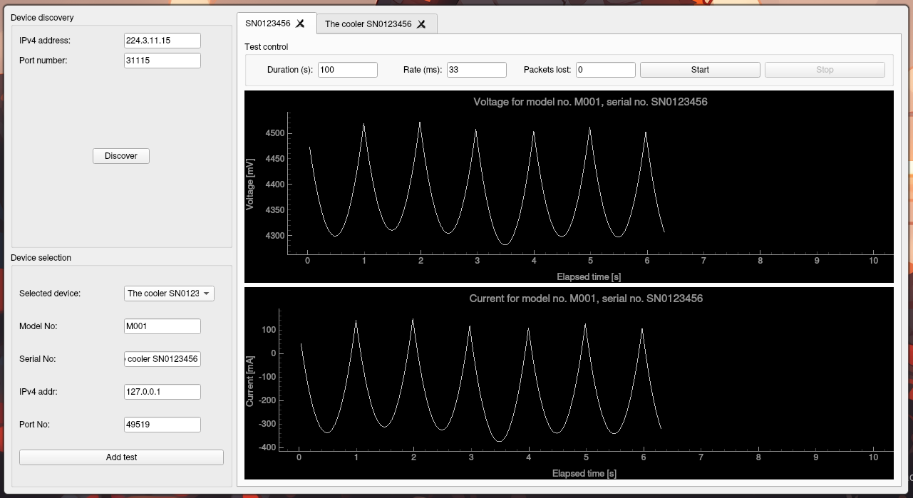

# Welcome

This repo is my submission for the position of production automation junior engineer.

# Dependencies

See requirements.txt for the required python packages, the python 3.14.3 was used for development. The application relies mainly on PyQt5, with the external dependency of pyqtgraph, which enables high performance plotting. Pyqtgraph was chosen over MatPlotLib because it offers better integration with Qt, is more lightweight and built for high performance, whereas the latter is better suited for static plots.

The code was developped and tested on ArchLinux' rolling release, with the Hyperland tiling manager. The appearance may vary on a different environment.

# Prerequisites

If connecting via multicast with the provided device simulation on the same computer, check that loopback is active with

    $ sudo ip route list | grep 224

To add it, run

    $ sudo ip route add 224.0.0.0/4 dev lo

# Usage

The application provides a test control GUI:

Before running a test, an arbitray number of devices must be active and discoverable. One way to achieve this is to execute the provided device simulation from multiple processes (eg. multiple terminals).

Start the application from the root folder with the command 

    $ python . 

For more verbose logs, the debug flag `-d` can also be specified.

To run a test, follow this procedure:

1. Run a device discovery, targetting either the device or the multicast address and port 
2. The discovered devices are now listed in the drop-down in the selection menu
3. Select the desired device(s) to test
4. Each device can have one active test at a time.
5. Press the start button to launch a test with the desired parameters, and stop to interrupt it at any time
6. While a test is running, other tests can be started in other tabs, beware of the known issues though.
7. A test may be restarted after being either interrupted or having finished
8. A test may be removed by closing the tab, but can be added again from the selection area. This will interrupt the test if it is running.

# Known issues

* Switching between test tabs too quickly while the tests are running may cause the ui to freeze
* Running a device discovery while the tests are active will interrupt all tests
* Crash if a discovered device becomes unavailable while a test is running
* Previously discovered devices remain available in the selection after successive discoveries, even if they are not found in the latest discovery

